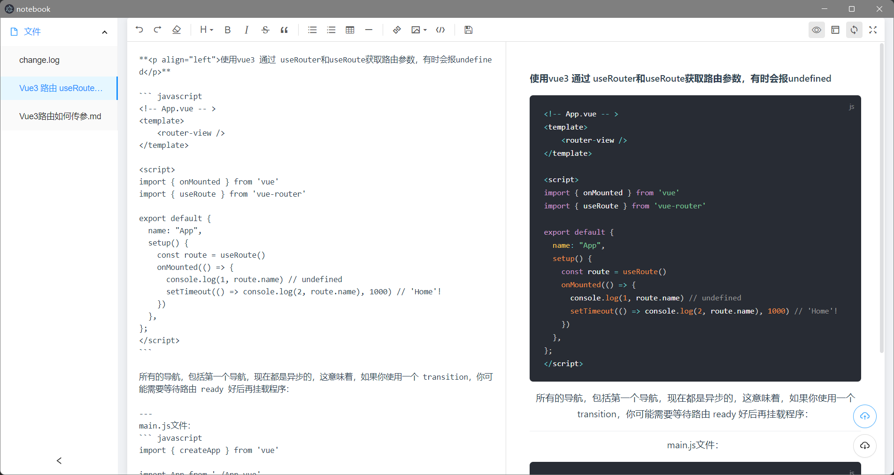

# notebook

## Project setup
```
npm install
```

### Compiles and hot-reloads for development
```
npm run electron:serve
```

### Compiles and minifies for production
```
npm run electron:build
```

### Lints and fixes files
```
npm run lint
```

自由编写markdown文件
### Customize configuration
See [Configuration Reference](https://cli.vuejs.org/config/).
